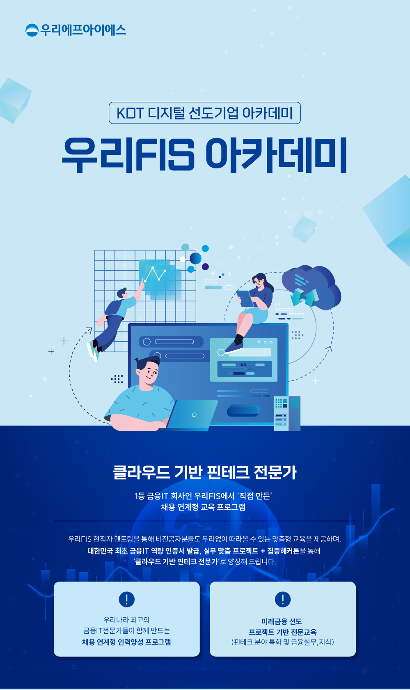

# 우리FISA
우리FISA 클라우드 서비스 개발자 과정에 참여하며 수행한 프로젝트, 블로그를 정리하였습니다.

  

[우리FIS 아카데미](http://www.woorifis.com/kor/peoplelife/futureLab/labInfo)
 

## 🥚 Front End 과정
#### 2023.04.24 ~ 5.25
### Project
|Project|Skills|Repository|
|-|-|-|
|우리FIS 주변 편의 시설 정보를 모아 소개|`HTML`, `CSS`|[moamoa](https://github.com/ooutta/moamoa)|
|네이버 API를 활용한 닮은꼴 찾기 서비스|HTML, CSS, `Javascript`, `Node.js`|[find-your-similarity](https://github.com/ooutta/find-your-similarity)|
|todo 리스트|HTML, CSS, Javascript, `Vue.js`|[vueTodo](https://github.com/ooutta/vueTodo)|
 

### Tech Seminar 
|주제|담당|Repository|
|-|-|-|
|Why we use Vue.js|SSR, CSR|[woorifisa-fe-tech-seminar](https://github.com/ooutta/woorifisa-fe-tech-seminar)|
 

### Class Code
https://github.com/ooutta/wooriFISA-class
 
 

## 🍳 Back End 과정
#### 2023.05.26 ~ 07.18
### Project
|Project|Skills|Repository|
|-|-|-|
|다빈치 코드 보드 게임|`Java`|[Gosling Game](https://github.com/woorifisa-service-dev/backend-1st-goslingcode)|
 

### Tech Seminar

 

### Class Code
https://github.com/ooutta/wooriFISA-back-end
 
 

## ☁️ Cloud Native 과정
#### 2023.07.19 ~ 08.01
### Project

 

### Tech Seminar

 

### Class Code
