
   
    

AWS에서 탄력적 IP의 개념과 적용 방법에 대해 발표드릴 김수현입니다.

 

   
    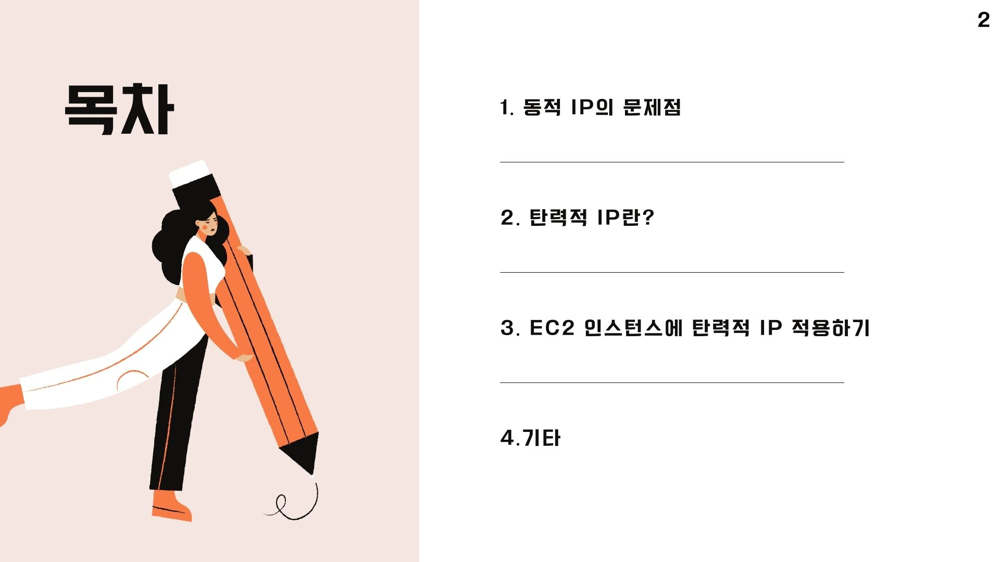

우선 목차로 탄력적 IP의 등장 배경으로 동적 IP를 사용했을 때의 문제점을 말씀드리고, 탄력적 IP의 개념과 제한 사항, 요금 정책에 대해 말씀드리려고 합니다. 그리고 실제 AWS EC2 인스턴스에 탄력적 IP를 적용하는 방법에 대해 설명드리겠습니다. 추가적으로 태그와 복구 방법, 계정 간 탄력적 IP 이전 방법에 대해서 말씀드리며 마무리하겠습니다.

 

   
    

먼저 동적 IP의 문제점을 말씀드리겠습니다.

 

   
    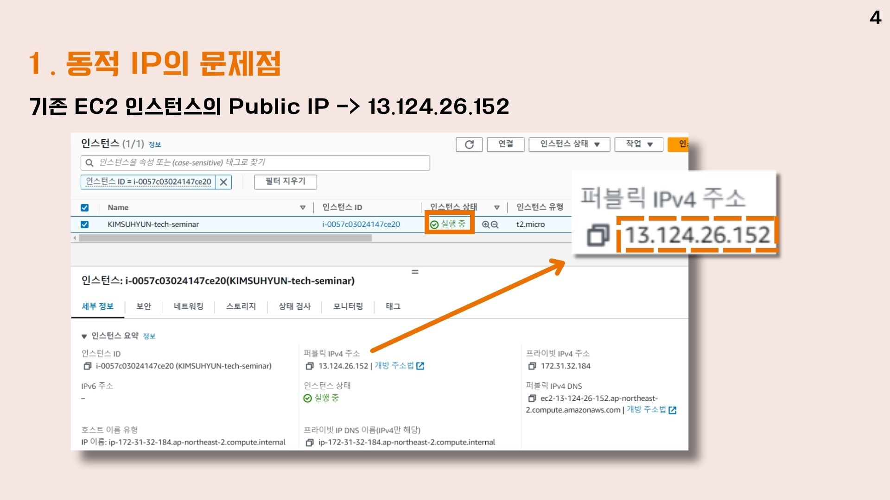

기본적으로 EC2 인스턴스를 생성하면 인스턴스의 상태가 "실행 중"이 되고, 하나의 Public IP 주소가 할당됩니다. 사진의 예시에서는 152로 끝나는 IP 주소가 할당된 것을 확인하실 수 있습니다.

 

   
    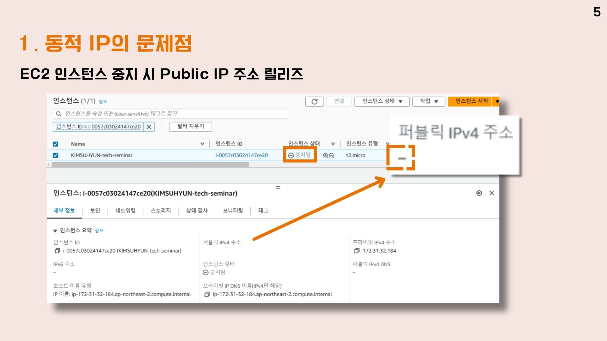

하지만 인스턴스를 중지하게 되면 이렇게 인스턴스의 상태가 "중지됨"으로 변경되고, Public IP가 릴리즈 됩니다. 사진에서도 Public IP가 사라진 것을 보실 수 있습니다.

 

   
    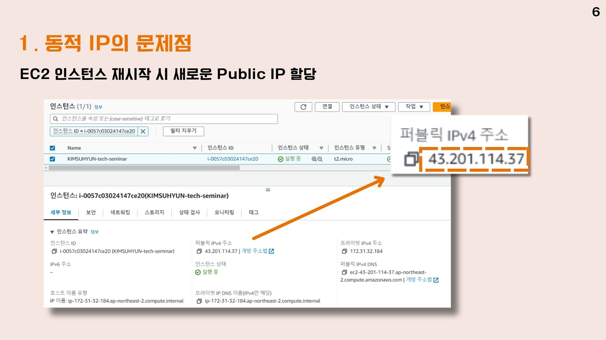

그리고 인스턴스를 다시 실하게 되면 인스턴스의 상태가 "실행 중"으로 변경되고, 이전의 152로 끝나는 Public IP 주소가 아닌, 37로 끝나는 새로운 Public IP 주소가 할당됩니다.

 

   
    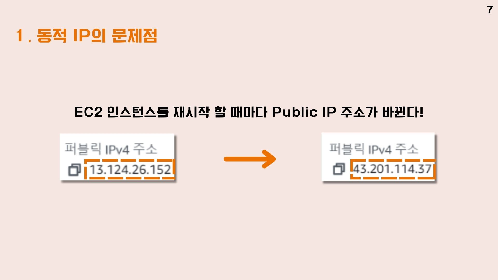

이렇게 인스턴스를 재시작하거나 인스턴스의 유형을 수정하는 등의 변경 사항이 생기면, 매번 기존 IP 주소가 릴리즈 되고, 새로운 IP 주소가 할당됩니다. 
  
이전에 보안 그룹을 통해서 인스턴스로 접속할 수 있는 IP들을 지정해놨었습니다. 이처럼 다른 외부의 리소스와 통신해야 하는 경우에, IP 주소가 계속 변경된다면 변경될 때마다 외부 리소스에게 변경된 IP를 매번 알려주고, 그럼 상대는 변경된 IP를 매번 보안그룹에서 수정해야합니다. 그리고 이러한 과정이 실시간으로 반영되지 않는다면, 데이터 손실 등의 문제가 발생할 수 있습니다. 

그래서 이러한 동적 IP의 문제를 해결하기 위해 저희는 고정된 정적 IP인 탄력적 IP라는 기술을 사용할 수 있습니다.

 

   
    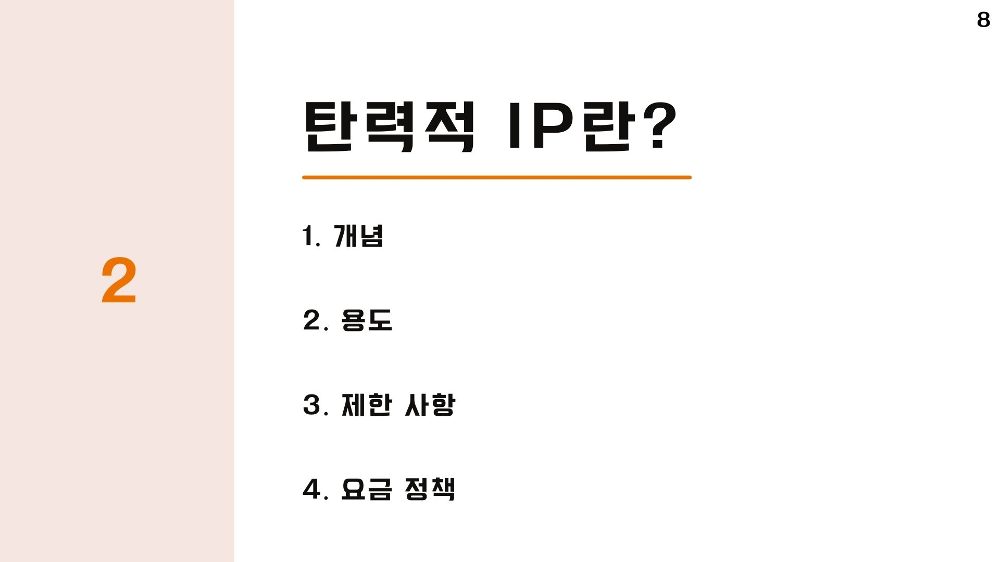

이어서 탄력적 IP의 개념과 연결해서 사용할 수 있는 리소스들과의 용도, 그리고 어떤 제한사항들이 있는지, 요금은 어떤 기준으로 부과되는지 살펴보겠습니다.

 

   
    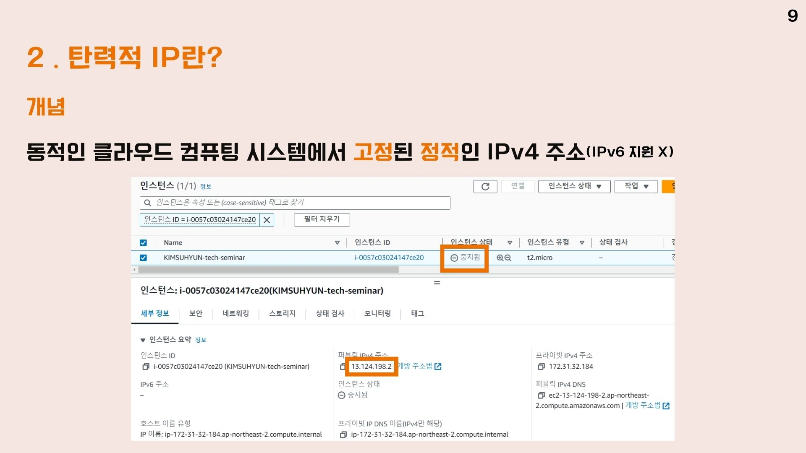

탄력적 IP란 동적인 컴퓨팅 시스템에서 변경되지 않는, 고정된 정적인 IP 주소를 의미합니다. 

현재 AWS에서는 IPv4에 대해서만 탄력적 IP를 지원하고 있습니다. 다양한 이유가 있지만, 대표적으로는 지금까지 인터넷의 주요 부분은 IPv4 기반으로 동작하고 있고, IPv4는 주소 고갈 위기에 처해있습니다. 이에 대응해서 탄력적 IP를 통해 사용하지 않는 자원은 반납하고 필요한 경우에만 IPv4 주소를 할당받아 사용합니다. 반면에 IPv6는 주소 부족 현상이 없어 탄력적 IP를 사용하지 안항도 됩니다. 

따라서 이렇게 Public IPv4 주소에 대해 탄력적 IP를 인스턴스와 연결해놓으면, 아래 사진과 같 인스턴스가 중지된 상태임에도 Public IP 주소가 사라지지 않고 고정되어 존재하게 됩니다.

 

   
    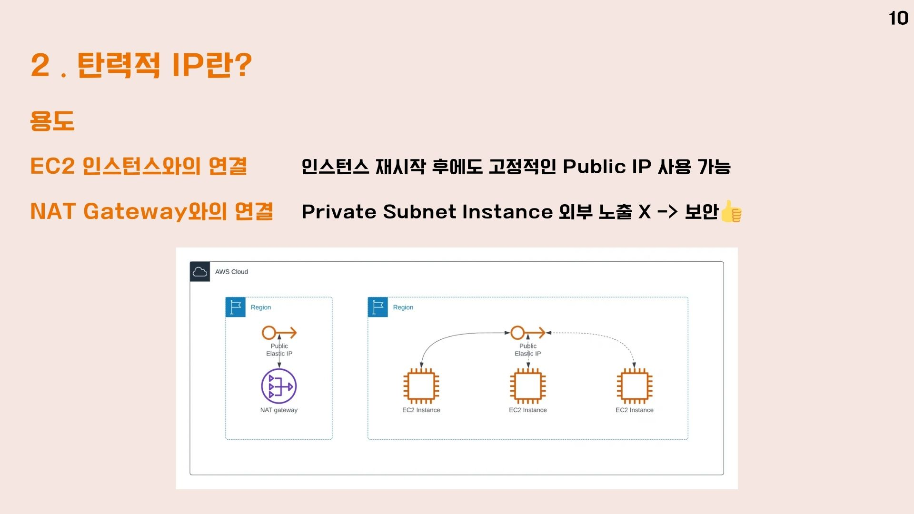

AWS의 탄력적 IP는 다양한 용도로 활용할 수 있습니다.

우선 앞서 보여드린 예시처럼 EC2 인스턴스에 인터넷이 직접 접근하기 위해 탄력적 IP를 적용할 수 있습니다.

또는 직접적인 Public IP를 사용하지 않고 NAT Gateway에 탄력적 IP를 할당해서, 프라이빗 서브넷의 인스턴스와 외부 인터넷 간의 통신을 할 수 있습니다. 이러한 방법은 프라이빗 서브넷 인스턴스를 외부에 노출시키지 않아 보안적인 면에서 이점이 있습니다.

 

   
    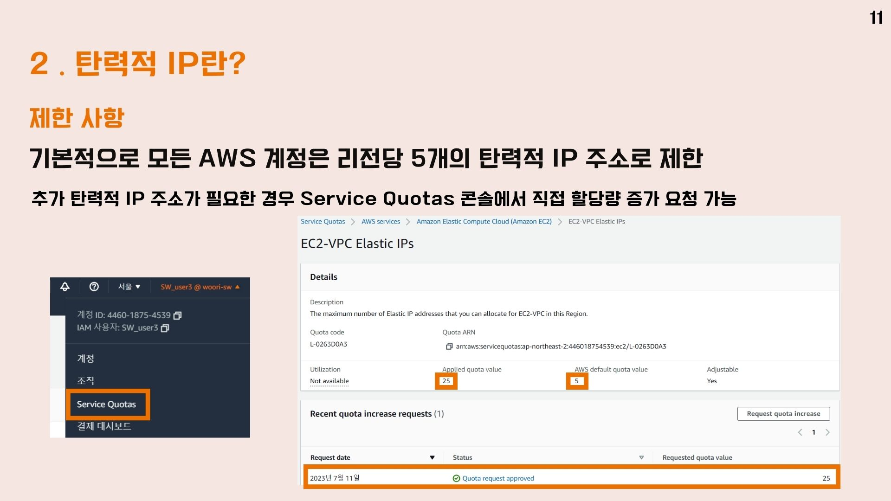

탄력적 IP는 IPv4의 제한된 주소를 효율적으로 사용하기 위해 기본적으로 모든 AWS 계정은 리전당 5개의 탄력적 IP만 사용할 수 있습니다.

추가 탄력적 IP 주소가 필요한 경우 Service Quotas 콘솔에서 직접 할당량 증가 요청이 가능합니다.

저희 탄력적 IP를 보면 10개가 생성되어 있는데요, Service Quotas에서 확인해보시면 25개로 증가 요청을 한 것을 보실 수 있습니다. 

 

   
    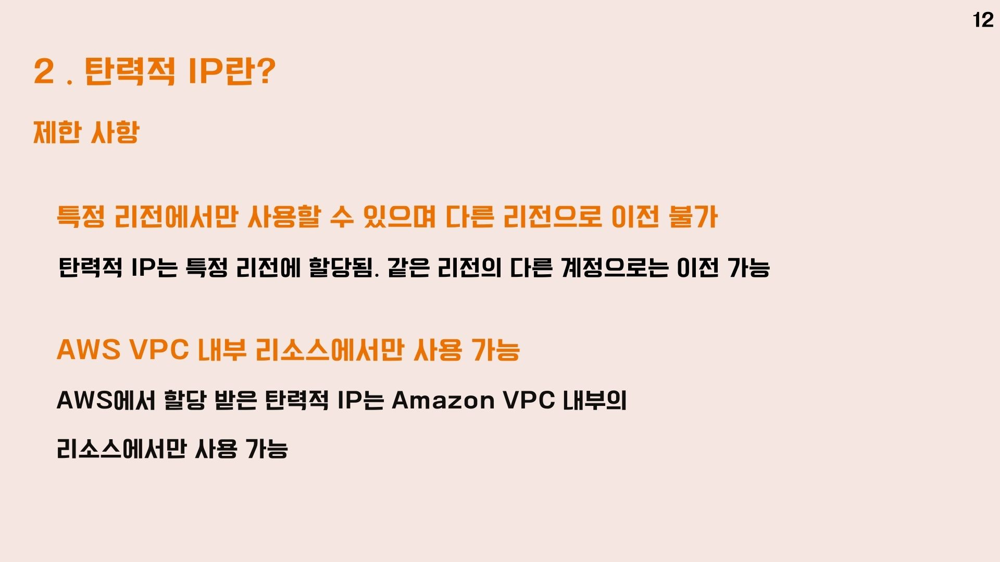

그리고 탄력적 IP는 특정 리전에 할당되기 때문에, 한 리전에서 할당된 탄력적 IP는 다른 리전으로 이동시킬 수 없습니다. 하지만 같은 리전 내의 다른 계정으로는 전달이 가능합니다.

그리고 AWS에서 할당 받은 탄력적 IP는 AWS VPC 내부의 자원에 대해서만 연결이 가능합니다. 다시 말해서, 같은 AWS 계정의 다른 VPC에서는 해당 탄력적 IP를 직접 할당받아 사용할 수 없습니다.

 

   
    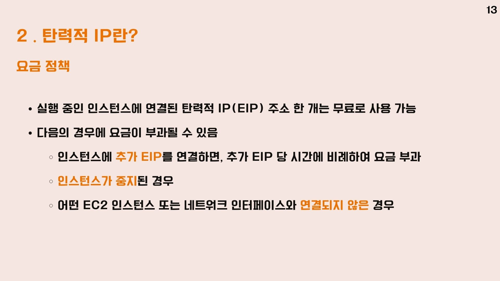

다음으로 요금에 대해 살펴보겠습니다. 실행되고 있는 인스턴스에 하나의 탄력적 IP를 할당하여 사용하는 것은 무료입니다.
  
그러나 인스턴스에 보조 IP를 설정하면, 탄력적 IP 주소를 추가로 할당할 수 있는데 이때 요금이 부과될 수 있습니다. 또한 탄력적 IP 주소를 할당해서 사용중이던 인스턴스가 중지된 상태이거나 어떤 리소스와도 연결이 되어있지 않으면 요금이 부과됩니다.

 

   
    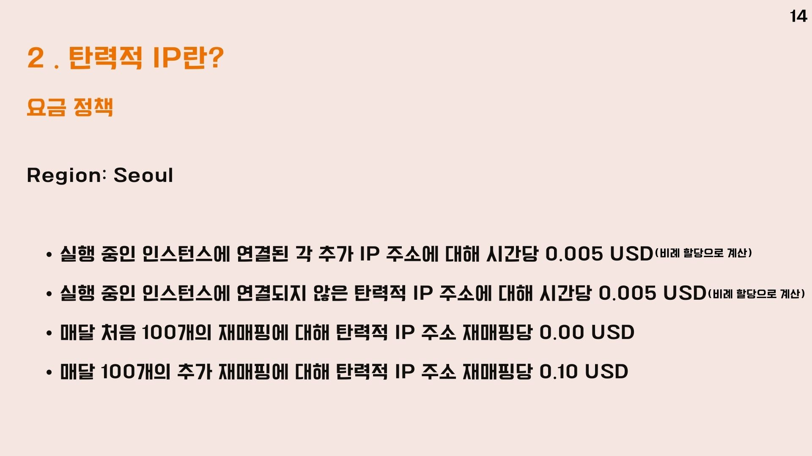

서울 리전에 대해서는 매달 하나의 탄력적 IP에 대해 최대 0.1달러까지 부과될 수 있습니다.

 

   
    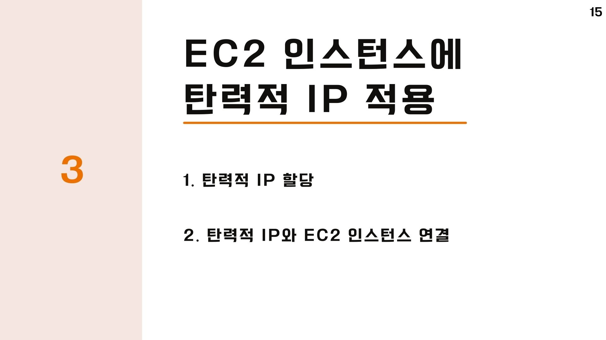

다음으로는 실제로 어떻게 탄력적 IP를 할당하고 EC2 인스턴스에 적용하는지 살펴보겠습니다.

 

   
    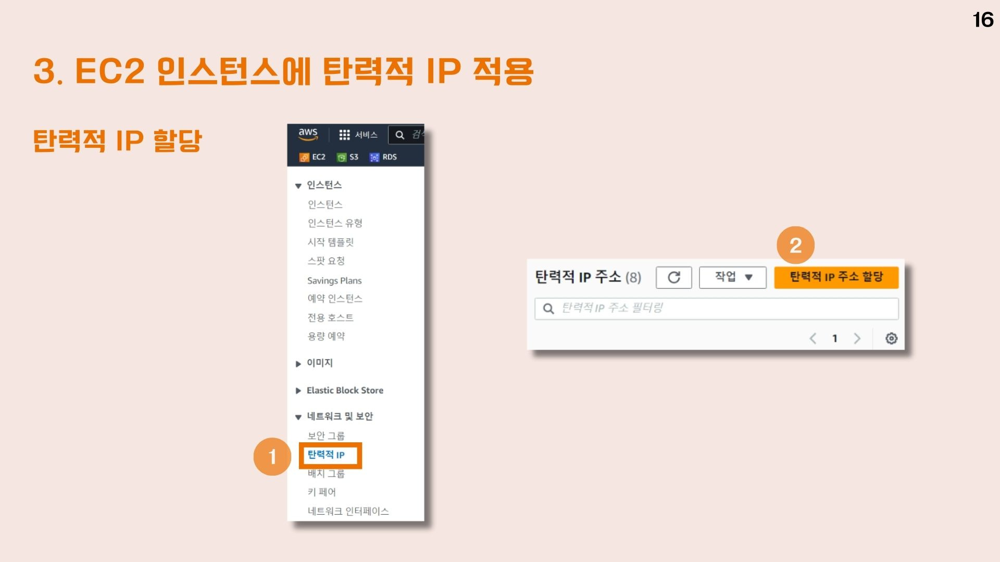

AWS의 EC2 서비스를 선택하시면 왼쪽 아래의 "네트워크 및 보안" 메뉴에 "탄력적 IP" 메뉴가 있습니다. 이를 선택하시면 오른쪽 화면이 뜨게 되는데 여기서 "탄력적 IP 주소 할당"을 선택하시면 

 

   
    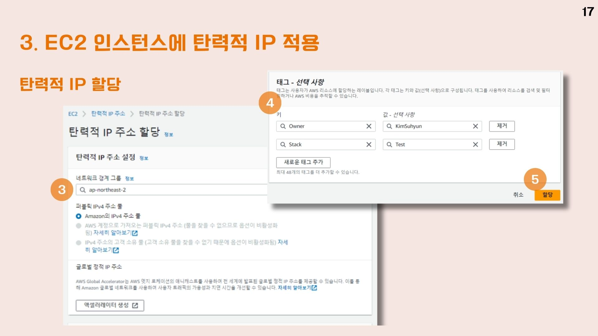

왼쪽과 같은 화면이 뜹니다. 여기서 네트워크 경계 그룹은 디폴트로 현재 리전이 선택되어 있기 때문에 그대로 두시면 됩니다. 그리고 아래로 내려가시면 오른쪽 사진과 같이 태그를 설정할 수 있습니다. 용도나 사용자에 따라 태그를 설정해두시면 이후 각 속성에 따라 탄력적 IP를 필터링하고 검색하는 데에 유용하니 필요에 따라 설정해주시면 되겠습니다. 다음으로 할당 버튼을 클릭하시면 

 

   
    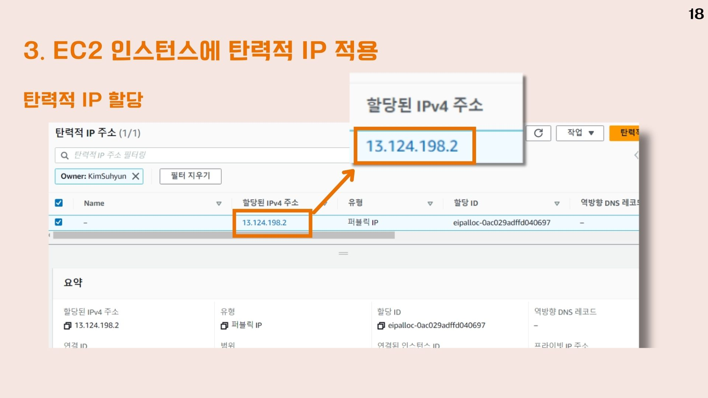

이렇게 2로 끝나는 탄력적 IP 주소가 할당된 것을 확인하실 수 있습니다. 이제 이 IP를 인스턴스와 어떻게 연결하는지 함께 살펴보겠습니다.

 

   
    

인스턴스와 연결하고자 하는 탄력적 IP를 선택하신 후, 작업->"탄력적 IP 주소 연결" 메뉴를 선택하시면 오른쪽 페이지가 등장합니다. 여기서 연결하고자 하는 인스턴스를 선택하신 후 연결 버튼을 클릭하시면 됩니다.

 

   
    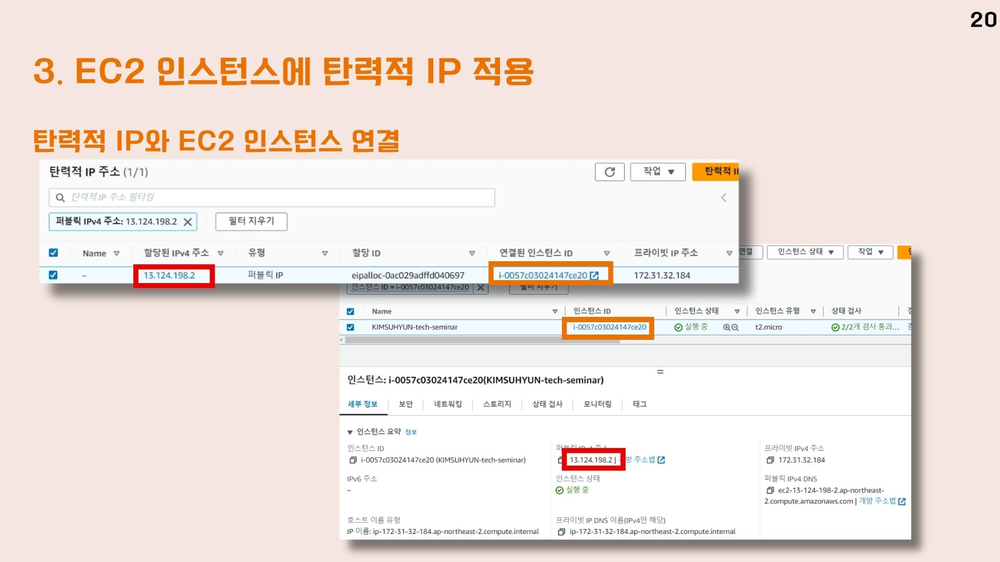

그러면 탄력적 IP 메뉴에서는 "연결된 인스턴스 ID"를 통해 인스턴스와 탄력적 IP가 연결된 것을 확인하실 수 있습니다. 그리고 인스턴스 메뉴의 아래 세부 정보 탭에서서 Public IP 주소가 저희가 이전에 할당 받은 2로 끝나는 탄력적 IP로 설정된 것을 보실 수 있습니다.

 

   
    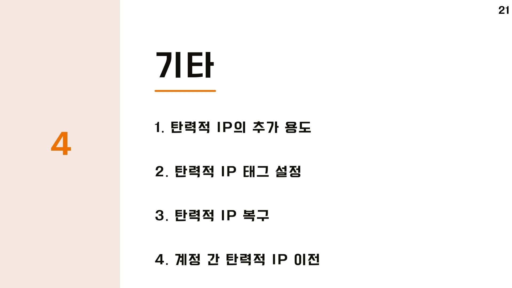

마지막 기타로는 탄력적 IP의 추가 용도와 태그 설정에 대해서 좀 더 자세히 살펴보겠습니다. 그리고 복구 방법과 계정 간 탄력적 IP를 이전하는 방법도 실습을 통해 함께 살펴보겠습니다.

 

   
    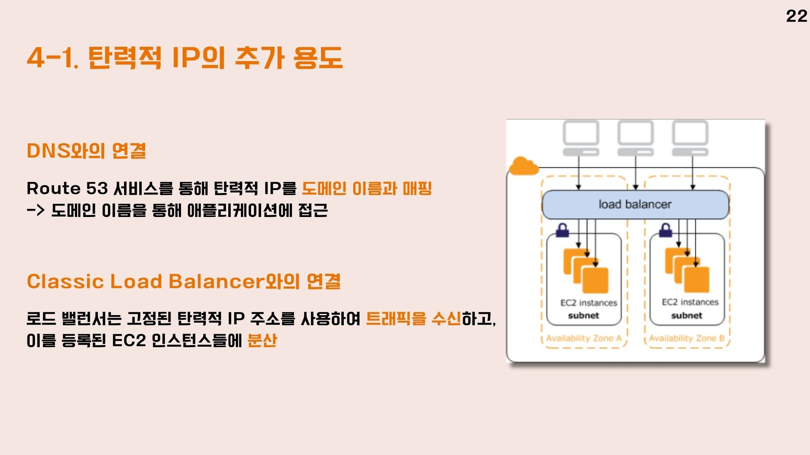

앞서 탄력적 IP의 용도로  말씀드렸던 인스턴스, NAT Gateway에 추가적으로 DNS와 Classic Load Balancer와 연결해서도 사용할 수 있습니다. 

DNS와 탄력적 IP를 매핑해서 사용자가 도메인을 통해 애플리케이션에 접근하도록 할 수 있습니다.

그리고 클래식 로드 밸런서와 연결해서 사용할 수 있습니다. 로드 밸런서에 고정 IP를 할당해줌으로써 고정된 IP로 트래픽을 수신하고, EC2 인스턴스의 보안 그룹에 해당 고정 IP를 인바운드 규칙에 추가해줘서 트래픽을 분산 처리할 수 있습니다.

 

   
    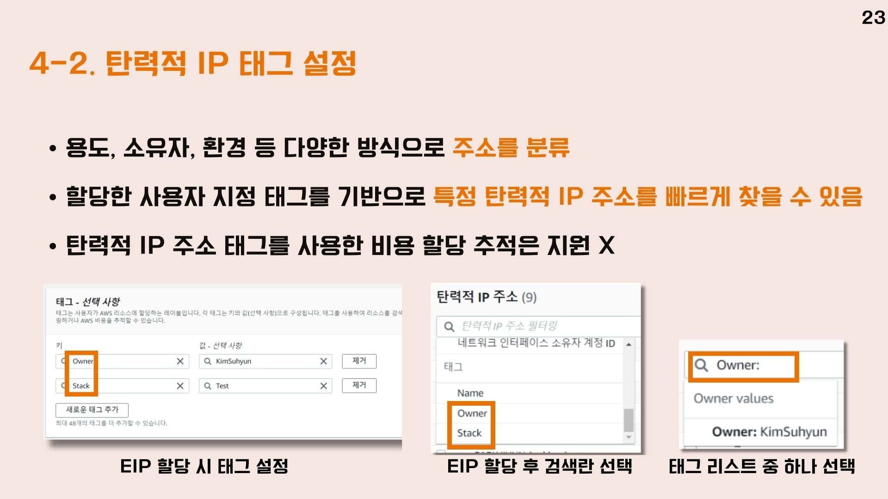

그리고 태그에 대해서도 추가적으로 말씀드리려고 합니다. 태그는 탄력적 IP의 용도, 소유자, 환경 등 다양한 방식으로 주소를 분류할 수 있습니다. 이렇게 사용자가 지정한 태그를 기반으로 특정 탄력적 IP 주소를 빠르게 찾을 수 있다는 이점이 있습니다. 하지만 이 태그를 이용한 비용 할당 추적은 지원되지 않습니다.

아래쪽 사진을 보시면 탄력적 IP를 생성할 때 저는 이렇게 Owner와 Stack이라는 Key로 태그를 설정해두었습니다. 그러면 여러 탄력적 IP 주소 목록에서 검색을 할 때 태그의 Key를 속성으로 소유자나 용도에 따라 탄력적 IP 주소를 빠르게 필터링하고 검색할 수 있습니다.

 

   
    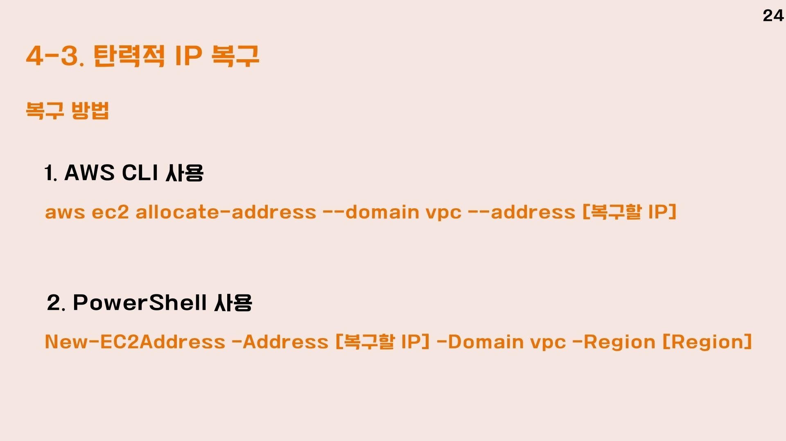

다음으로 탄력적 IP 주소의 복구 방법에 살펴보겠습니다. 탄력적 IP는 다른 AWS의 서비스들과는 다르게 자원을 해제할 때 따로 사용자의 입력을 통해 삭제를 확인하는 기능이 없습니다. 그렇기때문에 실수로 삭제하기가 쉽습니다. 저 또한 그랬던 경험이 있어서 복구하는 방법을 공유하려합니다.

복구는 AWS CLI과 PowerShell을 이용해서 가능합니다. 이중에서 간단히 AWS CLI를 이용해서 복구해보겠습니다.

 

   
    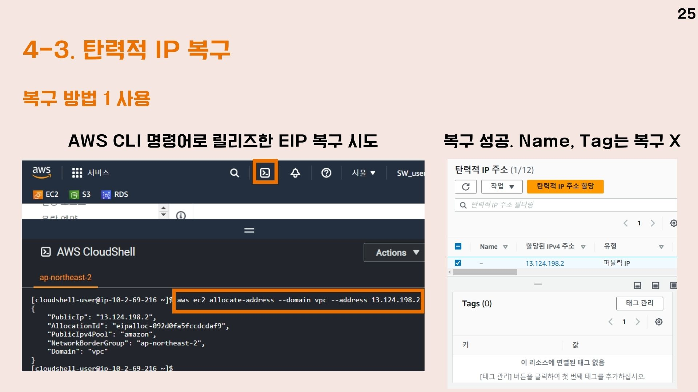

먼저 AWS 페이지에서 오른쪽 상단에 콘솔 아이콘을 선택하시면, AWS CloudShell 창이 뜹니다. 그리고 1번의 탄력적 IP 복구 명령어를 입력하고 뒤에 복구할 탄력적 IP를 입력하시면 오른쪽 사진에서처럼 복구된 것을 보실 수 있습니다. 하지만 IP만 복구되고 Name과 Tag는 복구되지 않으니 주의해서 사용하시면 될 것 같습니다.

 

   
    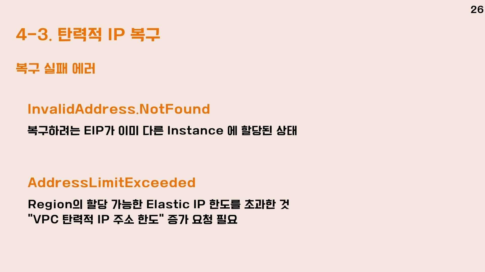

하지만 무조건 복구가 성공하는 것은 아닙니다. 

만약 복구하려는 탄력적 IP가 이미 다른 인스턴스에 할당된 상태라면 InvalidAddress.NotFound 에러가 발생하게 되고, 복구가 불가능합니다. 

또는 앞서 말씀드렸던 것 처럼 기본적으로 AWS 계정당 한 리전에 5개까지의 탄력적 IP를 할당 받을 수 있습니다. 그런데 만약 설정되어있는 탄력적 IP 개수의 범위를 초과하면 AddressLimitExceeded 에러가 발생하게 됩니다. 이러한 경우에 빠르게 "VPC 탄력적 IP 주소 한도" 증가 요청을 하신 후에, 다시 복구 명령어를 실행하시면 됩니다.

 

   
    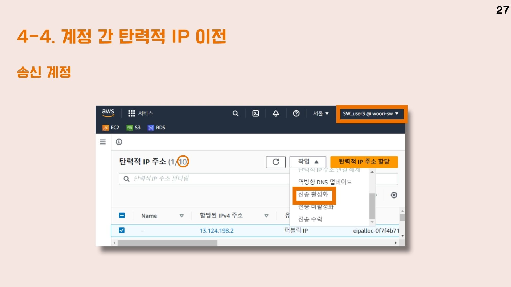

이제 끝으로 계정 간 탄력적 IP를 이전하는 방법에 대해서 말씀드리려고 합니다. 이 교육 기간동안에는 기관에서 제공해주는 AWS 계정을 통해서 여러 자원들을 사용할 수 있지만, 교육 기간이 끝나면 필요에 따라서 인스턴스같은 자원들을 개인 계정으로 이전해야 하실 수 있을 것 같아서 정리해보았습니다.

우선 여기서 탄력적 IP 주소는 총 10개가 있습니다. 이 중 이전하고자 하는 탄력적 IP를 가진 계정에 로그인 하신 후, 이전할 탄력적 IP를 선택하시고 작업 메뉴에서 "전송 활성화"를 선택하시면

 

   
    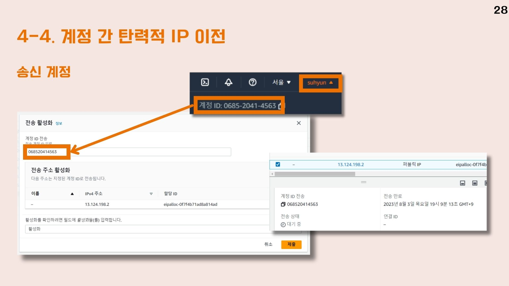

왼쪽 사진과 같은 페이지가 뜨게 됩니다. 여기서 "계정 ID 전송" 입력란에 탄력적 IP를 옮기고자 하는 여러분들의 개인 계정 ID를 복사해서 입력해주시면 됩니다. 그리고 활성화를 입력한 후 제출 버튼을 클릭하시면, 오른쪽 사진과 같이 전송할 계정 ID가 선택되어 있고 아직 전송되지 않았으므로 전송 상태가 "대기 중"인 것을 확인하실 수 있습니다. 

 

   
    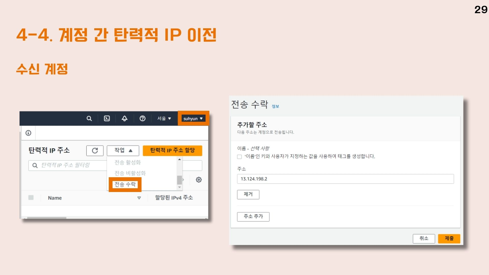

다음으로 탄력적 IP를 전달 받을 개인 수신 계정에서 탄력적 IP 주소 메뉴에 들어가신후 작업에서 "전송 수락" 메뉴를 선택하시면 오른쪽과 같은 페이지가 뜹니다. 여기서 전달 받을 탄력적 IP 주소를 입력하신 후 "제출" 버튼을 클릭하시면 

 

   
    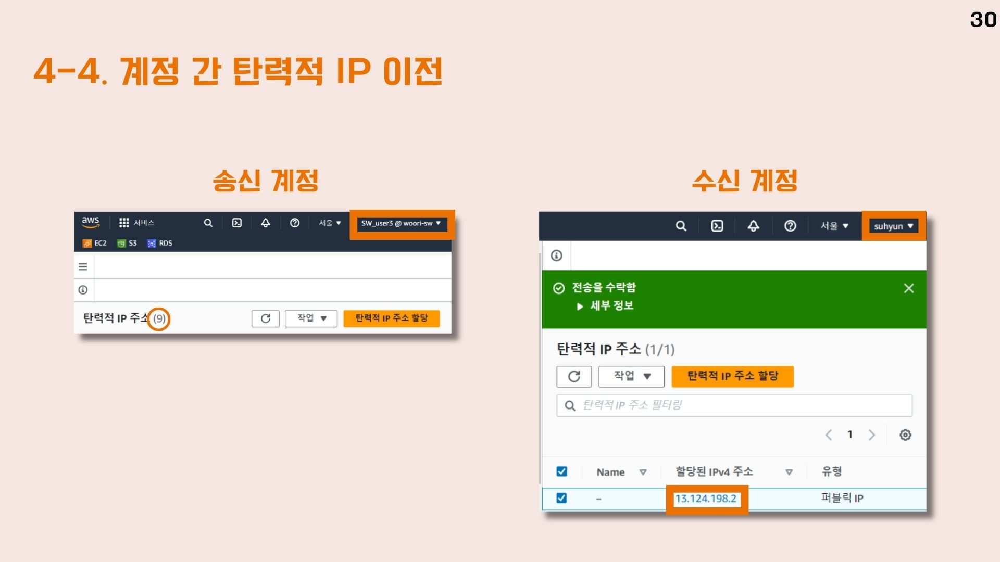

송신 계정의 탄력적 IP 주소는 10개에서 9개로 줄어든 것을 확인하실 수 있고, 수신 계정에서는 2로 끝나는 탄력적 IP 주소가 잘 이전된 것을 보실 수 있습니다.

 

   
    

지금까지 전달드린 내용들 잘 활용해서 프로젝트에 적용해보시면 좋을 것 같습니다. 발표 마치겠습니다. 감사합니다.

 

